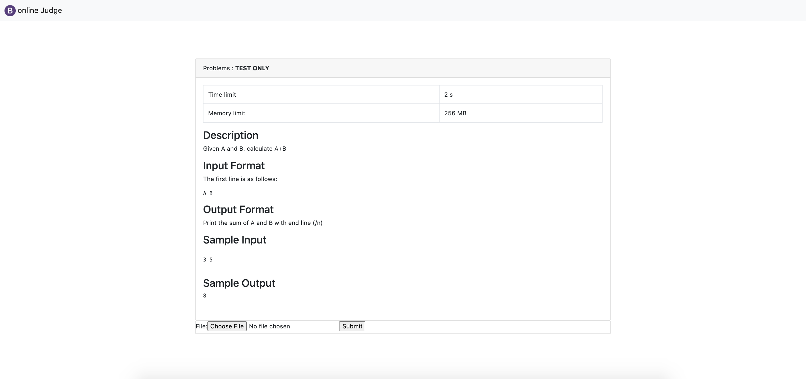
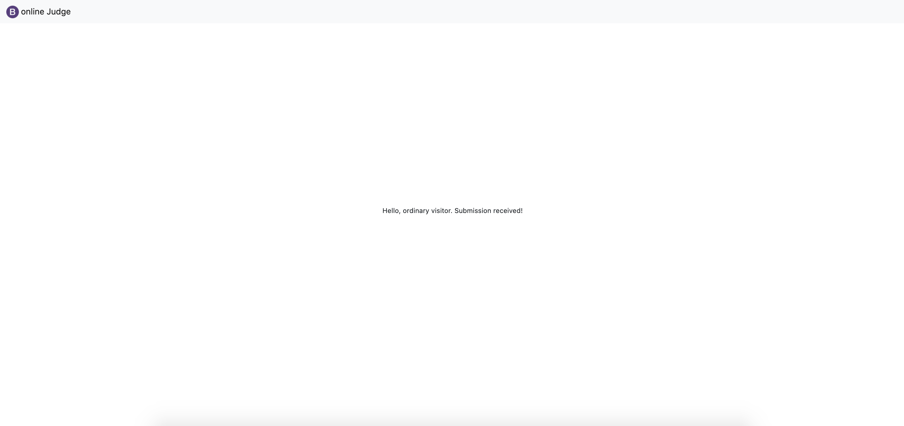
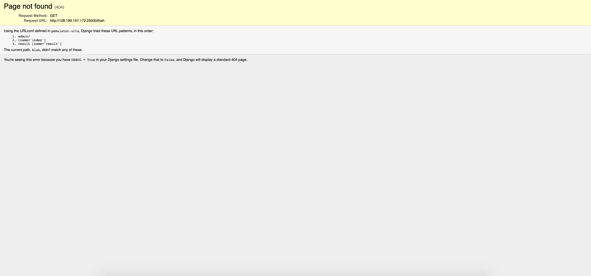
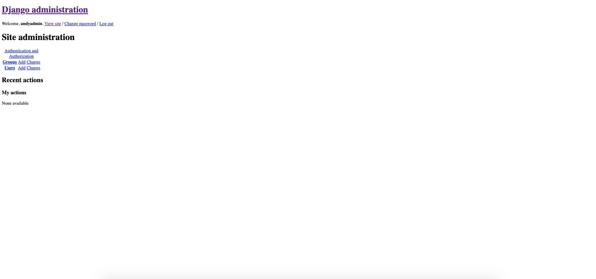
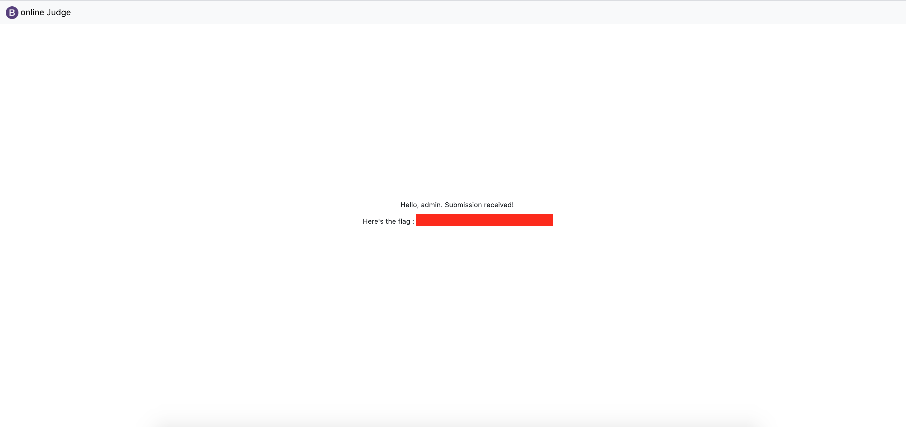

# Super judge

## Enumeration

We find a website where you can upload files. It specifies its a python emulator. 

Thereafter if you upload a file succesfully it will give you a response with hello ordinary user.

Afterwards I looked around and by going to random links i saw that 1. its a django application and 2. the routes which it checks for. So now I know that there is an admin page, index page and result page. The index being the page where you can upload, the result page being the page you are redirected to when you have uploaded a file.

So by playing around with uploading python files I found that it runs the python script. So I guessed that I could possibly affect the django application and by using the assigned script I was able to create an admin account for myself. See solution.py

Once uploaded I went to the admin login page

Logged in with my new credentials

As seen in the result.html file which was provided in the task, the flag is on this page. So go to /result and voila

